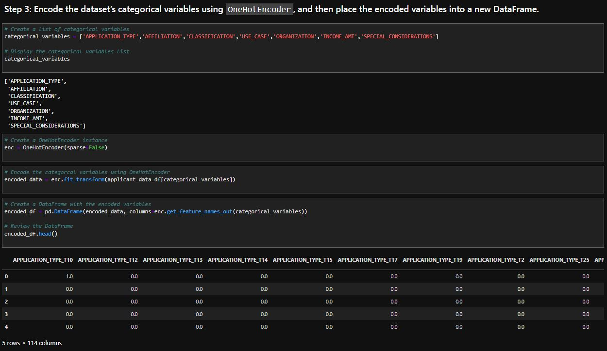

# Background

You work as a risk management associate at Alphabet Soup, a fictitious venture capital firm. The Alphabet Soup business team receives many funding applications from startups every day. This team has asked you to help them create a model that predicts whether applicants will become successful if funded by Alphabet Soup.

The team has given you a CSV file containing more than 34,000 organisations that have received funding from Alphabet Soup over the years. This file contains various types of information about the organisations, including whether they ultimately became successful. With your knowledge of machine learning and neural networks, you decide to use the features in the provided dataset to create a binary classifier model that will predict whether an applicant will become successful.

# What You're Creating
To predict whether Alphabet Soup funding applicants will be successful, you will create a binary classification model using a deep neural network.

This challenge consists of three technical deliverables. You will do the following:

Preprocess data for a neural network model.

Use the model-fit-predict pattern to compile and evaluate a binary classification model.

Optimise the model.

# Instructions
The instructions for this Challenge are divided into the following subsections:

* Prepare the Data for Use on a Neural Network Model
* Compile and Evaluate a Binary Classification Model by Using a Neural Network
* Optimise the Neural Network Model

# Prepare the Data for Use on a Neural Network Model
Using your knowledge of Pandas and StandardScaler from scikit-learn, preprocess the dataset so that you can later use it to compile and evaluate the neural network model. To do so, complete the following steps:

1. Read the applicants_data.csv file into a Pandas DataFrame. Review the DataFrame, checking for categorical variables that will need to be encoded and for columns that might eventually define your features and target variables.

2. Drop the “EIN” (Employer Identification Number) and “NAME” columns from the DataFrame, because they’re irrelevant for the binary classification model.

3. Encode the categorical variables of the dataset by using OneHotEncoder, and then place the encoded variables in a new DataFrame.

4. Add the numerical variables of the original DataFrame to the DataFrame that contains the encoded variables

**NOTE** 

To complete this step, use the Pandas concat function.

5. Using the preprocessed data, create the features (X) and target (y) datasets. The “IS_SUCCESSFUL” column in the preprocessed DataFrame should define the target dataset. The remaining columns should define the features dataset.

6. Split the features and target datasets into training and testing datasets.

7.  Use StandardScaler from scikit-learn to scale the features data.

# Compile and Evaluate a Binary Classification Model Using a Neural Network
Use your knowledge of TensorFlow to design a binary classification deep neural network model. This model should use the features of the dataset to predict whether a startup that’s funded by Alphabet Soup will become successful. Consider the number of inputs before determining both the number of layers that your model will contain and the number of neurons on each layer. Then compile and fit your model. Finally, evaluate your binary classification model to calculate the model’s loss and accuracy.

To do so, complete the following steps:

1. Use Tensorflow’s Keras to create a deep neural network by assigning the number of input features, the number of layers, and the number of neurons on each layer.

**hint**
You can start with a two-layer deep neural network model that uses the relu activation function for both layers.

2. Compile and fit the model by using the binary_crossentropy loss function, the adam optimiser, and the accuracy evaluation metric.

**hint**
When fitting the model, start with a small number of epochs, such as 20, 50, or 100.

3. Evaluate the model by using the test data to determine the model’s loss and accuracy.

4. Save and export your model to an HDF5 file, and name the file AlphabetSoup.h5.

# Optimise the Neural Network Model
Using your knowledge of TensorFlow and Keras, optimise your model to improve its accuracy. Even if you don’t achieve a better accuracy, you'll need to demonstrate at least two attempts to optimise the model. You can include these attempts in your existing notebook. Or, you can make copies of the starter notebook in the same folder, rename them, and code each model optimisation in a new notebook.

**note**
You won’t lose points if your model doesn’t achieve a high accuracy—as long as you make at least two attempts to optimise the model.

To do so, complete the following steps:

1. Define at least three new deep neural network models (that is, the original plus two optimisation attempts). For each, try to improve your first model’s predictive accuracy.

**rewind**

_Recall that perfect accuracy has a value of 1, so accuracy improves as its value moves closer to 1. To optimise your model for a predictive accuracy that’s as close as possible to 1, you can use any or all of the following techniques:_

2. Adjust the input data by dropping different feature columns to ensure that no variables or outliers confuse the model.

3. Add more neurons (nodes) to a hidden layer.

4. Add more hidden layers.

5. Use different activation functions for the hidden layers.

6. Increase or reduce the number of epochs in the training regimen.

7. Display the accuracy scores that each model achieved, and then compare the results.

8. Save each model as an HDF5 file.

